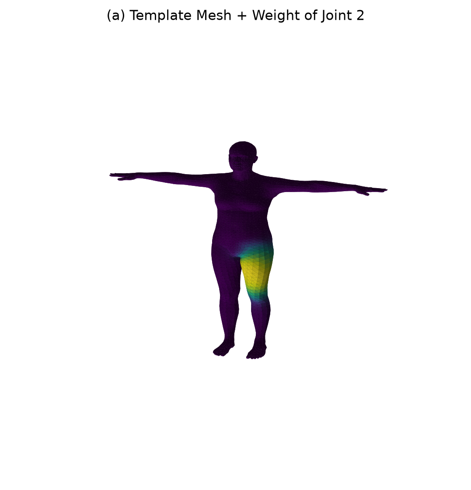
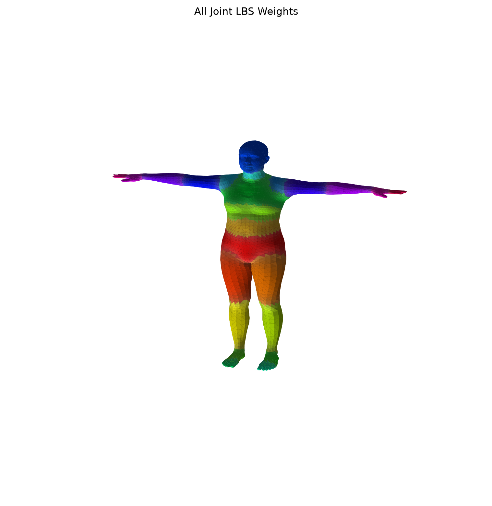
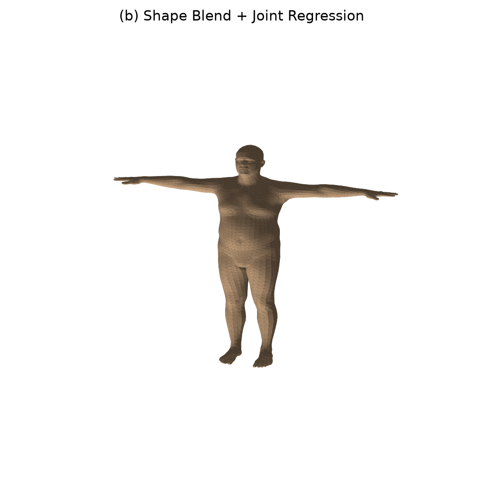
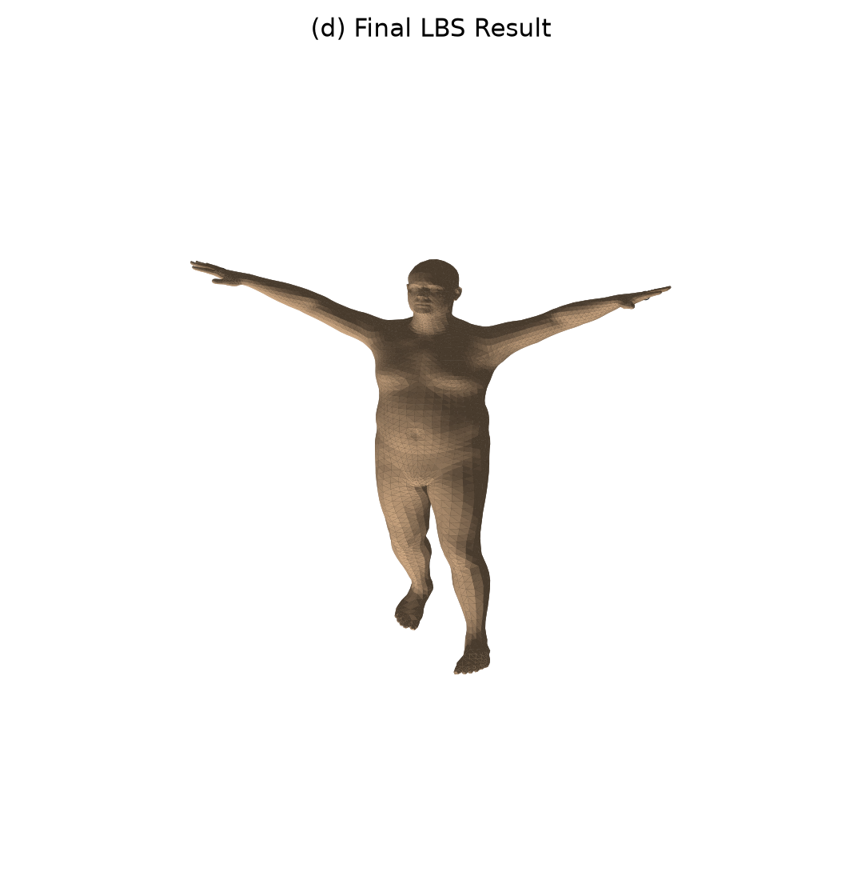
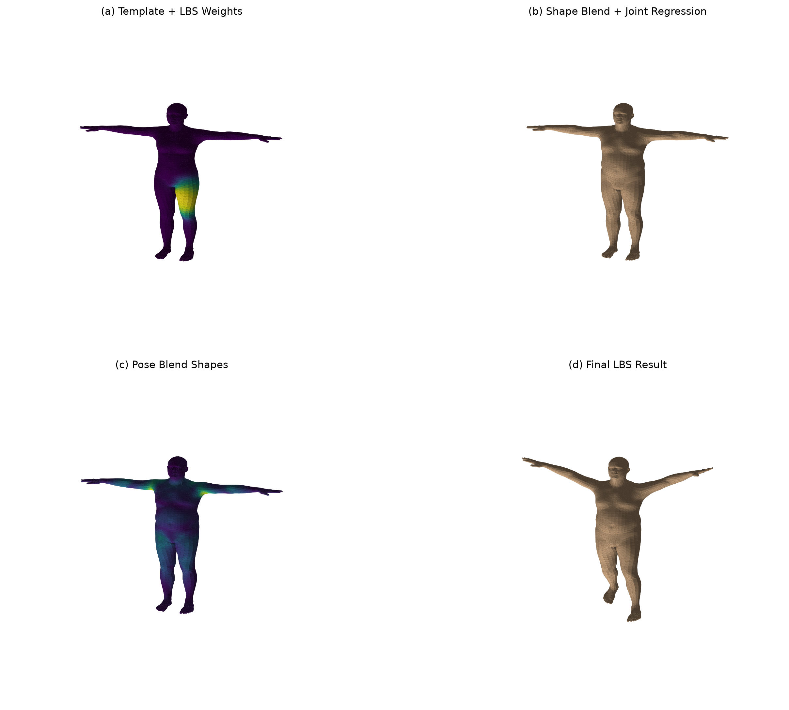
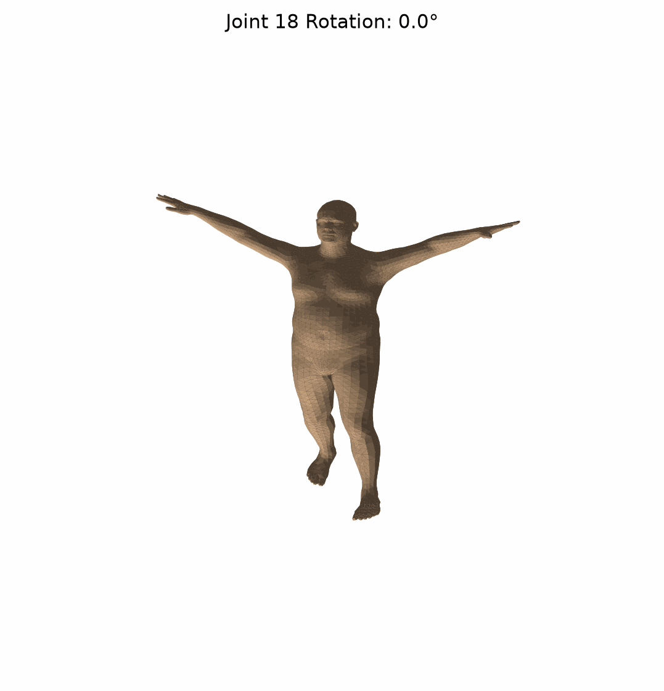

# 202411081104 杨衡 人工智能

<!--[程序执行指令](uv run -m src.lbs_lab.run_lbs_lab  --model-dir ./models --out-dir ./outputs --joint-id 2 --anim-joint-id 18 --anim-end-angle -90.0)--> 
# 实验8执行结果
## 修改教程范例新增输出gif，新增2个执行参数数，1.指定动画转动关节 2.从零度转动至最后角度
### 输出执行指令 uv run -m src.lbs_lab.run_lbs_lab  --model-dir ./models --out-dir ./outputs --joint-id 2 --anim-joint-id 18 --anim-end-angle -90.0

[实验8_summary.txt:记录模型基础信息以及手写 LBS 与官方前向结果的误差](./outputs/summary.txt "实验8_summary.txt")
## 实验选作内容执行结果

